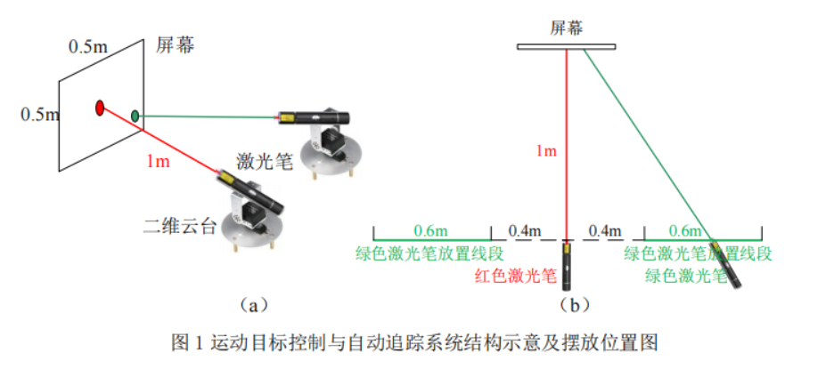

## 2023电赛运动目标控制与自动追踪系统（E 题）【本科组】

****

## 题目要求：

**1、 任务**

设计制作一个运动目标控制与自动追踪系统。系统包括模拟目标运动的红色光斑位置控制系统和指示自动追踪的绿色光斑位置控制系统。系统结构示意及摆放位置见图 1（a）。图中两个激光笔固定在各自独立的二维电控云台上。

红色激光笔发射的光斑用来模拟运动目标，光斑落在正前方距离 1m 处的白色屏幕上，光斑直径≤1cm。红色光斑位置控制系统控制光斑能在屏幕范围内任意移动。

绿色激光笔发射的光斑由绿色光斑位置系统控制，用于自动追踪屏幕上的红色光斑，指示目标的自动追踪效果，光斑直径≤1cm。绿色激光笔放置线段如 图 1（b）所示，该线段与屏幕平行，位于红色激光笔两侧，距红色激光笔距离大于 0.4m、小于 1m。绿色激光笔在两个放置线段上任意放置。屏幕为白色，有效面积大于 0.6╳0.6m2。用铅笔在屏幕中心画出一个边长

0.5m 的正方形，标识屏幕的边线；所画的正方形的中心为原点，用铅笔画出原点位置，所用铅笔痕迹宽≤1mm。

**2、 要求**

**1）.** **基本要求**

（1）设置运动目标位置复位功能。执行此功能，红色光斑能从屏幕任意位置回到原点。光斑中心距原点误差≤2cm。
（2）启动运动目标控制系统。红色光斑能在 30 秒内沿屏幕四周边线顺时针移动一周，移动时光斑中心距边线距离≤2cm。
（3）用约 1.8cm 宽的黑色电工胶带沿 A4 纸四边贴一个长方形，构成 A4 靶纸。将此 A4 靶纸贴在屏幕自定的位置。启动运动目标控制系统，红色光斑能在30 秒内沿胶带顺时针移动一周。超时不得分，光斑完全脱离胶带一次扣 2 分，连续脱离胶带移动 5cm 以上记为 0 分。
（4）将上述 A4 靶纸以任意旋转角度贴在屏幕任意位置。启动运动目标控制系统，要求同（3）。

**2）.** **发挥部分**

（1）运动目标位置复位，一键启动自动追踪系统，控制绿色光斑能在 2 秒内追踪红色光斑，追踪成功发出连续声光提示。此时两个光斑中心距离应≤3cm。
（2）运动目标重复基本要求（3）~（4）的动作。绿色激光笔发射端可以放置在其放置线段的任意位置，同时启动运动目标及自动追踪系统，绿色光斑能自动追踪红色光斑。启动系统 2 秒后，应追踪成功，发出连续声光提示。此后，追踪过程中两个光斑中心距离大于 3cm 时，定义为追踪失败，一次扣 2 分。连续追踪失败 3 秒以上记为 0 分。运动目标控制系统和自动追踪系统均需设置暂停键。同时按下暂停键，红色和绿色光斑应立即制动，以便测量两个光斑中心距离。
（3）其他。

**3、 说明**
（1）红色、绿色光斑位置控制系统必须相互独立，之间不得有任何方式通信；光斑直径小于 1cm；屏幕上无任何电子元件；控制系统不能采用台式计算机或笔记本电脑。不符合要求不进行测试。
（2）基本要求（3）、（4）未得分不进行发挥部分（2）的测试。

---

## 摘要

本系统以STM32F103C8T6单片机最小系统作为控制核心，由K210视觉模块，激光笔模块，舵机云台模块，降压模块等模块组成。红色激光云台可实现原点复位功能，绕屏幕边框运动功能，可以识别A4靶纸黑色边框，并做到控制红色激光落点寻找黑色边框做顺时针移动。

系统功能通过按键独立控制，可随时切换，急停等，且具有半自动机械校准功能，以达到更精确的运动目标控制指标。系统结构简单，稳定性好,易于使用。

本系统以STM32F103C8T6单片机组成的运动目标控制与自动追踪系统，主要由主控制模块、视觉模块、红外激光模块、舵机云台模块 三个个部分组成，对目标标志位及激光落点进行实时判断与运动。本系统可实现通过舵机复位指定框图中心，并且在指定线框内运动。可以识别A4纸黑色边框，并做到操控舵机转向从而控制红色激光落点寻黑色边框做绕周运动。可通过视觉模块识别红色激光落点，并且控制舵机转向绿色激光做到激光落点追踪。系统使用PID进行控制，做到实时检测运动状态 并进行简单预测。

**关键词**：K210视觉检测  单片机（MCU） 舵机云台控制

## 一、系统方案

## 二、理论分析与计算

## 三、电路与程序设计

## 四、 测试方案与测试结果

## 五、总结

